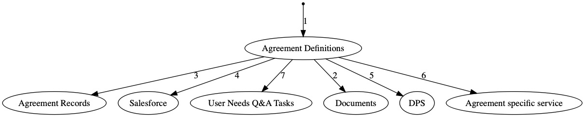

# 10. Use shared definition of CMp agreement when building all CMp services

Date: 2018-07-10

## Status

Accepted

## Context

The same agreement definitions for CMP services will be needed for suppliers to define their offers, and buyer journeys to select offers from. Also there will be many common elements shared between agreements, such as the tasks for buyers (and suppliers) to complete in order to complete a buying journey.

For each version of a CMp agreement, both buyer and supplier services, will have to release their code in sync to make sure that supplier responses to their service offer questions line up with buyer selection activities.

For example, a framework will have a number of lots, each with a number of services. The services may have various parameters - like cost models, date ranges, locations. Suppliers to that framework will need to answer questions that map to these services. These things should be defined in a consistent way so build pipelines can be built consistently.

Build pipelines may find it more convenient to pull Agreement definition files from a backing repository rather than an API. 

## Decision

The structure of all agreements will be defined in a common CCS GitHub repository. For example, the lot and item structure of frameworks should be defined in the repository so that web forms can be built in a repeatable way without having to code the agreement. 

The structure of the data is yet to be defined but will map to OCDS standards wherever practical. It will include _elements like_:

- Agreement schema
    - Lot structure
      - Service items
        - descriptions for buyers
        - value parameters (price, description, location, timelines etc)
        - question and answer formats for suppliers 
      - Qualification criteria
    - links to supporting Documents (in S3)
    - supporting content
    - relevant tasks and Q&A text
    - Interests  (links supplier offer to agreement)
        -Supplier Offers
          -(service, offer details)

The ‘agreement schema’ should be built in a technology agnostic way, using a data schema. Example domain models for different languages can be generated from the schema.

We will probably use a data schema like format, such as yaml. 

 1. edit a new version of Agreement -  e.g. new services
 2. add / link new related attachments
 3. update Agreement API
 4. update SalesForce content / pages
 5. new content and questions/answer forms for suppliers
 6. update purchase services
 7. define text and structure for user tasks with relation to agreement

## Consequences

- All services must define their agreement code from a shared repository
- The design of agreements metamodel is critical
- Code in different agreement services will have to be configured or generated from common definitions
